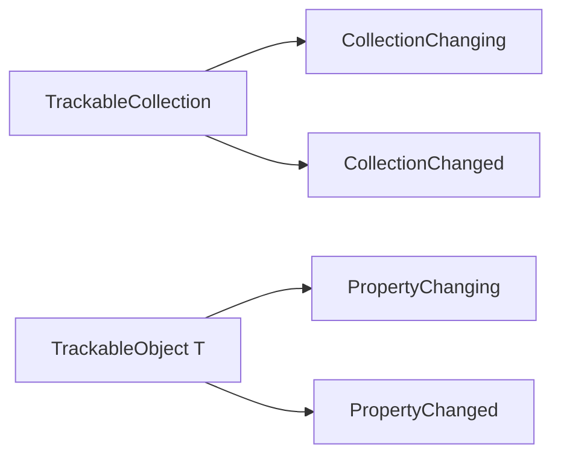

# Trackable Notifications

## Overview

`IIIF.Manifests.Serializer.Shared.Trackable.Notifications` defines synchronous events raised
before and after property or collection changes.

| API family | Public types |
| --- | --- |
| Collection event arguments | `TrackableCollectionChangeEventArgs`, `TrackableCollectionChangingEventArgs`, `TrackableCollectionChangingEventArgs<T>`, `TrackableCollectionChangedEventArgs`, `TrackableCollectionChangedEventArgs<T>` |
| Collection delegates | `TrackableCollectionChangingEventHandler`, `TrackableCollectionChangedEventHandler`, `TrackableCollectionChangedEventHandler<TCollection,T>` |
| Object event arguments | `TrackableObjectPropertyChangingEventArgs`, `TrackableObjectPropertyChangedEventArgs` |
| Object delegates | `TrackableObjectPropertyChangingEventHandler<T>`, `TrackableObjectPropertyChangedEventHandler<T>` |

Collection arguments expose `Item`, `Index`, and `ChangeType`. Object-property arguments expose
`PropertyName`, `IsCollection`, and nullable `ChangeType`. Generic collection arguments add a
strongly typed `Item`.

## Diagrams

Handlers run synchronously; callers must provide their own synchronization when objects are shared
between threads.

## See also

- [Trackable overview](../README.md)
- [Trackable collections](../Collections/README.md)
- [Trackable objects](../Objects/README.md)
