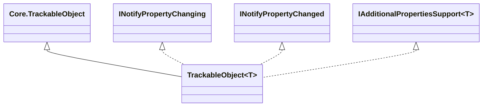

# Trackable Objects

## Overview

`IIIF.Manifests.Serializer.Shared.Trackable.Objects` contains the generic
`TrackableObject<TTrackableObject>` partial class used by SDK model types. It layers strongly typed
fluent getters/setters, property notifications, child/collection subscription, and additional JSON
property support over the non-generic core base.

| File | Responsibility |
| --- | --- |
| `TrackableObject.cs` | Events, notification interfaces, descriptor exposure, and attachment lifecycle |
| `TrackableObject.Getters.cs` | Typed descriptor reads |
| `TrackableObject.Setters.cs` | Typed fluent writes and collection normalization |
| `TrackableObject.AdditionalProperties.cs` | `IAdditionalPropertiesSupport<T>` implementation and Newtonsoft.Json extension-data bridge |

## Diagrams

Instances are mutable and are not thread-safe.

## See also

- [Trackable overview](../README.md)
- [Core tracking types](../Core/README.md)
- [Notifications](../Notifications/README.md)
