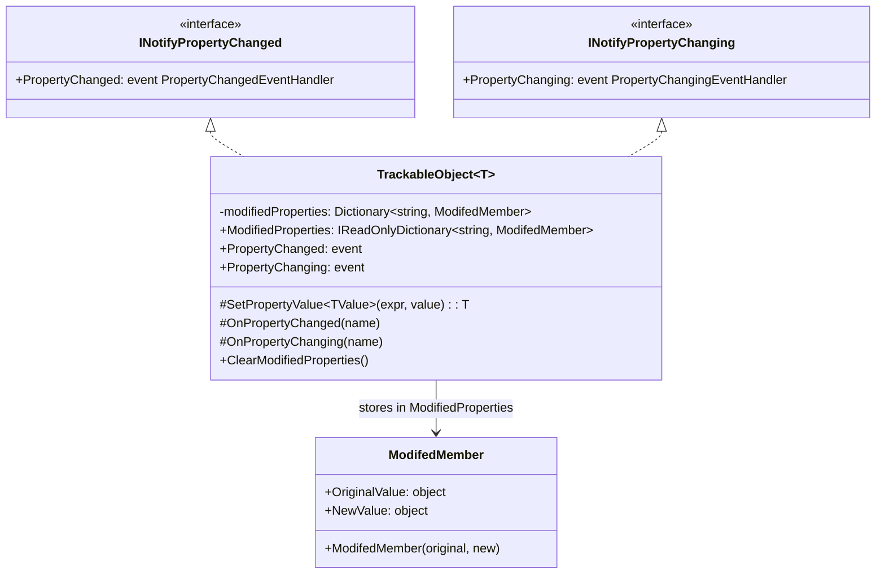
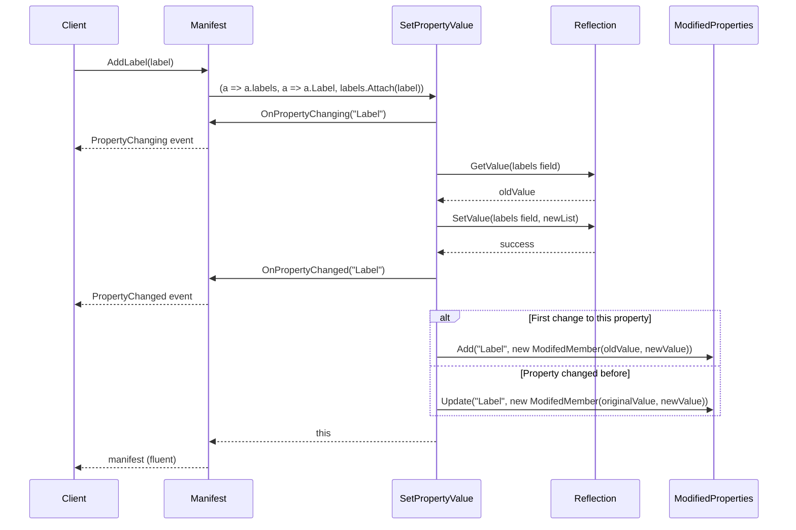
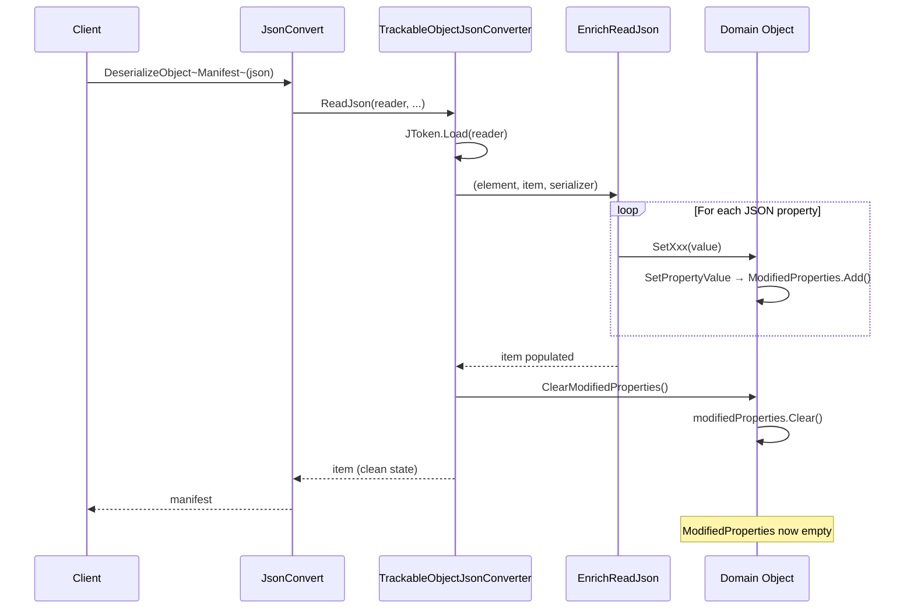

# Trackable

## Contents
- [Overview](#overview)
- [Files](#files)
- [Types & Members](#types--members)
- [TrackableObject](#trackableobject)
- [ModifiedMember](#modifiedmember)
- [TrackableObjectJsonConverter](#trackableobjectjsonconverter)
- [Diagrams](#diagrams)
- [Examples](#examples)
- [See Also](#see-also)

## Overview

The Trackable folder implements the foundational change-tracking pattern for the entire IIIF Presentation API 2.0 serialization library. TrackableObject provides immutable public properties with private setters, fluent mutation through SetPropertyValue that records original and current values in ModifiedProperties, and INotifyPropertyChanged/INotifyPropertyChanging events. ModifiedMember captures each property's original and new values. TrackableObjectJsonConverter clears ModifiedProperties after deserialization, forces indented formatting, and provides extension points (EnrichReadJson/EnrichWriteJson) for derived converters using Newtonsoft.Json.

## Files

| File | Primary type(s) | LOC (approx) | Responsibility |
|------|-----------------|--------------|----------------|
| [TrackableObject.cs](../../../src/IIIF.Manifest.Serializer.Net/Shared/Trackable/TrackableObject.cs) | `TrackableObject<T>` | 89 | Generic base class with SetPropertyValue, ModifiedProperties, and change notification |
| [ModifedMember.cs](../../../src/IIIF.Manifest.Serializer.Net/Shared/Trackable/ModifedMember.cs) | `ModifedMember<T>`, `ModifedMember` | 18 | Captures original and new values for tracked property changes |
| [TrackableObjectJsonConverter.cs](../../../src/IIIF.Manifest.Serializer.Net/Shared/Trackable/TrackableObjectJsonConverter.cs) | `TrackableObjectJsonConverter<T>` | 45 | Base JsonConverter that forces indented formatting and clears ModifiedProperties |

[↑ Back to top](#contents)

## Types & Members

| Type | Kind | Summary | Inherits/Implements | Key Members |
|------|------|---------|---------------------|-------------|
| `TrackableObject<T>` | Abstract class | Base for all domain types; tracks property changes in ModifiedProperties and raises INotifyPropertyChanged events | `INotifyPropertyChanged`, `INotifyPropertyChanging` | `ModifiedProperties`, `SetPropertyValue<TValue>`, `ClearModifiedProperties`, `OnPropertyChanged`, `OnPropertyChanging` |
| `ModifedMember<T>` | Class | Holds original and new value for a single property change | N/A | `OriginalValue`, `NewValue` |
| `ModifedMember` | Class | Non-generic variant with object values | `ModifedMember<object>` | Inherited members |
| `TrackableObjectJsonConverter<T>` | Abstract class | Base converter that enforces indented formatting and clears ModifiedProperties after deserialization | `JsonConverter<T>` | `ReadJson`, `WriteJson`, `EnrichReadJson`, `EnrichWriteJson` |

[↑ Back to top](#contents)

## TrackableObject

Generic abstract base class that implements the immutable-property pattern. All Add*/Remove*/Set* methods flow through `SetPropertyValue`, which uses reflection to mutate private fields, raises PropertyChanging/PropertyChanged events, and records the change in ModifiedProperties. Constraint `where TTrackableObject : TrackableObject<TTrackableObject>` enables fluent returns of the derived type.

### Properties

- `ModifiedProperties` (IReadOnlyDictionary<string, ModifedMember>) – Read-only view of all tracked changes; key is property name
- `PropertyChanged` (event) – Raised after property value changes
- `PropertyChanging` (event) – Raised before property value changes

### Methods

- `SetPropertyValue<TValue>(Expression<Func<T, TValue>> expression, TValue value)` – Primary mutation method; extracts member name from expression, updates via reflection, tracks change
- `SetPropertyValue<TValue>(Expression<Func<T, TValue>> expression, Expression<Func<T, TValue>> memberNameExpression, TValue value)` – Overload that allows explicit member name expression for tracking name override
- `ClearModifiedProperties()` – Clears ModifiedProperties dictionary; called by TrackableObjectJsonConverter after deserialization
- `OnPropertyChanged(string propertyName)` – Raises PropertyChanged event
- `OnPropertyChanging(string propertyName)` – Raises PropertyChanging event

### Constructor Pattern

TrackableObject has no public constructor. Derived types typically use:
```csharp
protected internal BaseItem(string id) : base() { }
```

### Usage

```csharp
// Manifest inherits TrackableObject<Manifest>
var manifest = new Manifest("https://example.org/manifest", new Label("Book"));

// AddSequence flows through SetPropertyValue
manifest.AddSequence(sequence);

// Check what changed
foreach (var (propName, change) in manifest.ModifiedProperties)
{
    Console.WriteLine($"{propName}: {change.OriginalValue} → {change.NewValue}");
}
// Output: "Sequences: (empty list) → (list with 1 item)"

// Subscribe to change events
manifest.PropertyChanged += (sender, args) => Console.WriteLine($"Changed: {args.PropertyName}");
manifest.AddLabel(new Label("Updated")); // Prints "Changed: Label"
```

[↑ Back to top](#contents)

## ModifiedMember

Simple record class that holds the original and new value for a property change. Generic `ModifedMember<T>` provides type safety, while non-generic `ModifedMember` uses `object` for mixed-type tracking.

### Properties

- `OriginalValue` (TValueType or object) – Value before mutation
- `NewValue` (TValueType or object) – Value after mutation

### Constructor

- `ModifedMember(TValueType originalValue, TValueType newValue)` – Generic constructor
- `ModifedMember(object originalValue, object newValue)` – Non-generic constructor (base class)

### Usage

```csharp
// Created automatically by SetPropertyValue
var member = new ModifedMember(oldValue, newValue);

// Stored in ModifiedProperties
modifiedProperties.Add("PropertyName", member);

// Later retrieved
var change = manifest.ModifiedProperties["Label"];
Console.WriteLine($"Label changed from {change.OriginalValue} to {change.NewValue}");
```

[↑ Back to top](#contents)

## TrackableObjectJsonConverter

Abstract base converter for all TrackableObject derivatives. Enforces indented JSON formatting (Formatting.Indented) and clears ModifiedProperties after deserialization to avoid pollution from construction. Provides extension points EnrichReadJson and EnrichWriteJson for derived converters.

### Methods

- `ReadJson(JsonReader reader, Type objectType, T existingValue, bool hasExistingValue, JsonSerializer serializer)` – Loads JToken, calls EnrichReadJson, clears ModifiedProperties, returns item
- `WriteJson(JsonWriter writer, T value, JsonSerializer serializer)` – Forces Formatting.Indented, writes JObject via EnrichWriteJson
- `EnrichReadJson(JToken element, T item, JsonSerializer serializer)` – Virtual extension point; derived converters populate item from element
- `EnrichWriteJson(JObject jObject, T item, JsonSerializer serializer)` – Virtual extension point; derived converters add properties to jObject

### Derived Converters

All converters in the library inherit this class:
- BaseItemJsonConverter → BaseNodeJsonConverter → BaseContentJsonConverter → ManifestJsonConverter, CanvasJsonConverter, etc.
- FormatableItemJsonConverter → BaseResourceJsonConverter → ImageResourceJsonConverter, etc.

### Usage

```csharp
// Example derived converter
public class ManifestJsonConverter : BaseNodeJsonConverter<Manifest>
{
    protected override void EnrichReadJson(JToken element, Manifest item, JsonSerializer serializer)
    {
        base.EnrichReadJson(element, item, serializer); // Parse BaseNode fields
        
        // Parse manifest-specific fields
        var jNavDate = element.TryGetToken(Manifest.NavDateJName);
        if (jNavDate != null)
            item.SetNavDate(DatetimeHelper.ParseISO8601String(jNavDate.Value<string>()));
        
        // After EnrichReadJson completes, TrackableObjectJsonConverter.ReadJson
        // calls item.ClearModifiedProperties()
    }
    
    protected override void EnrichWriteJson(JObject jObject, Manifest item, JsonSerializer serializer)
    {
        base.EnrichWriteJson(jObject, item, serializer); // Write BaseNode fields
        
        // Write manifest-specific fields
        if (item.NavDate.HasValue)
            jObject.Add(Manifest.NavDateJName, item.NavDate.Value.ToString("o"));
    }
}
```

[↑ Back to top](#contents)

## Diagrams

### TrackableObject Architecture



### SetPropertyValue Flow



### JsonConverter Clearing ModifiedProperties



[↑ Back to top](#contents)

## Examples

### Basic Change Tracking

```csharp
var manifest = new Manifest("https://example.org/manifest", new Label("Book"));

// Initially empty
Console.WriteLine(manifest.ModifiedProperties.Count); // 0 (cleared after deserialization)

// Make changes
manifest.SetViewingDirection(ViewingDirection.RightToLeft);
manifest.AddSequence(new Sequence());

// Check what changed
foreach (var (name, change) in manifest.ModifiedProperties)
{
    Console.WriteLine($"{name}: {change.OriginalValue} → {change.NewValue}");
}
// Output:
// ViewingDirection: Unspecified → RightToLeft
// Sequences: (empty) → (1 item)
```

### Property Change Notifications

```csharp
var manifest = new Manifest("https://example.org/manifest", new Label("Book"));

// Subscribe to events
manifest.PropertyChanging += (sender, args) => 
    Console.WriteLine($"About to change: {args.PropertyName}");

manifest.PropertyChanged += (sender, args) => 
    Console.WriteLine($"Changed: {args.PropertyName}");

// Trigger changes
manifest.AddLabel(new Label("Updated"));
// Output:
// About to change: Label
// Changed: Label

manifest.SetNavDate(DateTime.UtcNow);
// Output:
// About to change: NavDate
// Changed: NavDate
```

### Custom Type with TrackableObject

```csharp
[JsonConverter(typeof(MyCustomTypeJsonConverter))]
public class MyCustomType : TrackableObject<MyCustomType>
{
    [JsonProperty("value")]
    public string Value { get; private set; }
    
    [JsonProperty("count")]
    public int Count { get; private set; }
    
    public MyCustomType(string value, int count)
    {
        Value = value;
        Count = count;
    }
    
    public MyCustomType SetValue(string value) 
        => SetPropertyValue(a => a.Value, value);
    
    public MyCustomType IncrementCount() 
        => SetPropertyValue(a => a.Count, Count + 1);
}

// Usage
var obj = new MyCustomType("initial", 0)
    .SetValue("updated")
    .IncrementCount()
    .IncrementCount();

Console.WriteLine(obj.ModifiedProperties["Value"].NewValue);  // "updated"
Console.WriteLine(obj.ModifiedProperties["Count"].NewValue);  // 2
```

### Deserialization Clears ModifiedProperties

```csharp
var json = @"{
  ""@context"": ""http://iiif.io/api/presentation/2/context.json"",
  ""@id"": ""https://example.org/manifest"",
  ""@type"": ""sc:Manifest"",
  ""label"": ""Book""
}";

var manifest = JsonConvert.DeserializeObject<Manifest>(json);

// ModifiedProperties is empty after deserialization
Console.WriteLine(manifest.ModifiedProperties.Count); // 0

// Because TrackableObjectJsonConverter.ReadJson called:
// 1. EnrichReadJson (which populated properties via SetPropertyValue)
// 2. ClearModifiedProperties() (which cleared the dictionary)

// Now make a change
manifest.AddLabel(new Label("New Label"));

// Only new changes tracked
Console.WriteLine(manifest.ModifiedProperties.Count); // 1
Console.WriteLine(manifest.ModifiedProperties["Label"].OriginalValue); // Previous label list
Console.WriteLine(manifest.ModifiedProperties["Label"].NewValue);      // Updated label list
```

[↑ Back to top](#contents)

## See Also

- [../BaseItem/README.md](../BaseItem/README.md) – First concrete use of TrackableObject
- [../BaseNode/README.md](../BaseNode/README.md) – Extensive use of SetPropertyValue for metadata
- [../../Helpers/README.md](../../Helpers/README.md) – CollectionHelper.Attach/Detach used with SetPropertyValue
- [../README.md](../README.md) – Parent Shared folder overview
- [System.ComponentModel.INotifyPropertyChanged](https://docs.microsoft.com/en-us/dotnet/api/system.componentmodel.inotifypropertychanged) – .NET change notification interface

[↑ Back to top](#contents)
