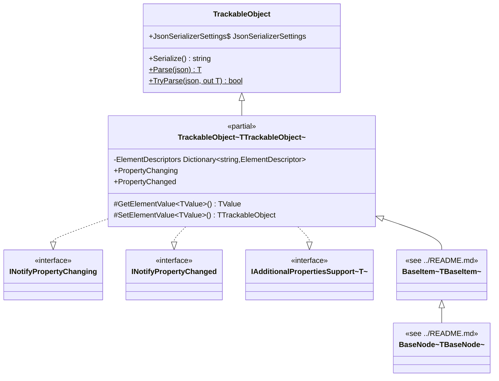
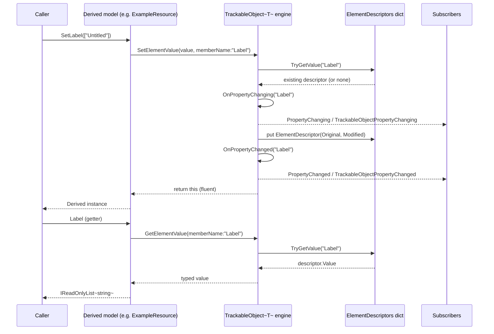

# Trackable

## Contents

- [Overview](#overview)
- [Files](#files)
- [Types & Members](#types--members)
  - [TrackableObject](#trackableobject)
  - [TrackableObject\<TTrackableObject\>](#trackableobjectttrackableobject)
  - [ElementDescriptor\<TValueType\>](#elementdescriptortvaluetype)
  - [ElementDescriptor](#elementdescriptor)
  - [IAdditionalPropertiesSupport\<TAdditionalPropertiesSupport\>](#iadditionalpropertiessupporttadditionalpropertiessupport)
  - [TrackableObjectPropertyChangedEventArgs](#trackableobjectpropertychangedeventargs)
  - [TrackableObjectPropertyChangedEventHandler](#trackableobjectpropertychangedeventhandler)
  - [TrackableObjectPropertyChangingEventArgs](#trackableobjectpropertychangingeventargs)
  - [TrackableObjectPropertyChangingEventHandler](#trackableobjectpropertychangingeventhandler)
- [Diagrams](#diagrams)
- [Package Dependencies](#package-dependencies)
- [See Also](#see-also)

## Overview

`Shared/Trackable` is the architectural bedrock of the entire IIIF object model in this SDK: `TrackableObject<TTrackableObject>` is the base class that (directly, or via `BaseItem<T>`/`BaseNode<T>`) every single model type in the library ultimately derives from. Rather than using plain auto-properties, every derived class stores its data in a single reflection-free, string-keyed dictionary of `ElementDescriptor`s and exposes it through a uniform `GetElementValue`/`SetElementValue` pair — this is what gives the whole SDK its fluent setter chains (`new Manifest().SetId(...).SetLabel(...)`), its per-property change tracking (`ModifiedValue`/`IsModified`), its `INotifyPropertyChanging`/`INotifyPropertyChanged` eventing (including bubbling from nested trackable objects and lists), and its unknown/extension-property round-tripping. It also owns the one fixed, non-version-aware Newtonsoft.Json serialization path (`TrackableObject.Parse<T>` / `.Serialize()`) used by types that never need the SDK's version-dispatching `IiifSerializer` facade. Understanding this folder is a prerequisite for understanding almost everything else in the codebase.

[↑ Back to top](#contents)

## Files

| File | Primary type(s) | LOC (approx) | Responsibility |
|---|---|---|---|
| `TrackableObject.cs` | `TrackableObject`, `TrackableObject<TTrackableObject>` (partial) | 357 | Core engine file. Non-generic `TrackableObject` holds the fixed `JsonSerializerSettings` plus `Serialize()`/`Parse<T>`/`TryParse<T>`. Generic `TrackableObject<T>` (this file is the "main" partial slice) holds the `ElementDescriptors` backing dictionary, the change-notification events, the private static `SetElementValue`/`GetElementValue` core algorithms, `GetMemberName`, and the private nested `AdditionalPropertiesDictionary` / `[JsonExtensionData]` bridge. |
| `TrackableObject.Getters.cs` | `TrackableObject<TTrackableObject>` (partial) | 29 | Partial-class slice adding the four `protected` instance `GetElementValue` overloads (by-name and by-expression, with/without `isModified` out param) that every derived model's property *getters* call. |
| `TrackableObject.Setters.cs` | `TrackableObject<TTrackableObject>` (partial) | 38 | Partial-class slice adding the four `protected` instance `SetElementValue` overloads (by-name/by-expression, value/factory) that every derived model's fluent *setters* call. |
| `TrackableObject.AdditionalPropertiesHandler.cs` | `TrackableObject<TTrackableObject>` (partial) | 46 | Partial-class slice providing the explicit `IAdditionalPropertiesSupport<TTrackableObject>` implementation, routing "additional" (extension/unknown) property access through the same core `SetElementValue`/`GetElementValue` engine with `isAdditional: true`. |
| `ElementDescriptor.cs` | `ElementDescriptor<TValueType>`, `ElementDescriptor` | 50 | Defines the change-tracking record stored per property: original value, modified value, `IsModified`, `IsAdditional`. `ElementDescriptor` is the non-generic (`object`-valued) concrete type actually stored in `TrackableObject<T>.ElementDescriptors`. |
| `IAdditionalPropertiesSupport.cs` | `IAdditionalPropertiesSupport<TAdditionalPropertiesSupport>` | 50 | Public self-constrained (CRTP-style) interface defining the get/set surface for extension/unknown JSON properties, used by external extension packages (navPlace, Georeference, TextGranularity) that need to attach data to a `TrackableObject` without being part of the core IIIF model. |
| `TrackableObjectPropertyChangedEventArgs.cs` | `TrackableObjectPropertyChangedEventArgs` | 19 | Extends `PropertyChangedEventArgs` with `IsList`/`ListChangedType` so subscribers can distinguish a scalar-property change from a list mutation and inspect which kind. |
| `TrackableObjectPropertyChangedEventHandler.cs` | delegate `TrackableObjectPropertyChangedEventHandler` | 2 | Delegate type for the custom `TrackableObjectPropertyChanged` event. |
| `TrackableObjectPropertyChangingEventArgs.cs` | `TrackableObjectPropertyChangingEventArgs` | 10 | Extends `PropertyChangingEventArgs` with an `IsList` flag, raised *before* a property/list is mutated. |
| `TrackableObjectPropertyChangingEventHandler.cs` | delegate `TrackableObjectPropertyChangingEventHandler` | 2 | Delegate type for the custom `TrackableObjectPropertyChanging` event. |

[↑ Back to top](#contents)

## Types & Members

Namespace for every type in this folder: `IIIF.Manifests.Serializer.Shared.Trackable`.

| Type | Kind | Summary | Inherits/Implements | Key Members |
|---|---|---|---|---|
| `TrackableObject` | class | Non-generic root: fixed JSON settings + static parse/serialize entry points. | *(none)* | `JsonSerializerSettings`, `Serialize()`, `Parse<T>`, `TryParse<T>` |
| `TrackableObject<TTrackableObject>` | partial class (generic, CRTP) | The dictionary-backed, change-tracked, eventing engine every model type derives from. | `TrackableObject`; `INotifyPropertyChanging`; `INotifyPropertyChanged`; (explicitly) `IAdditionalPropertiesSupport<TTrackableObject>` | `ElementDescriptors`, `PropertyChanging`/`PropertyChanged` (+ custom variants), `GetElementValue<TValue>` (×4 overloads), `SetElementValue<TValue>` (×4 overloads), `OnPropertyChanging`/`OnPropertyChanged`, `AdditionalPropertiesData` |
| `ElementDescriptor<TValueType>` | class (generic) | Change-tracking record: original vs. modified value for one property. | `IDisposable` | `OriginalValue`, `ModifiedValue`, `Value`, `IsModified`, `IsAdditional` |
| `ElementDescriptor` | class | Non-generic, `object`-valued specialization; the actual dictionary value type. | `ElementDescriptor<object>` | (inherited only) |
| `IAdditionalPropertiesSupport<TAdditionalPropertiesSupport>` | interface (generic, CRTP) | Public get/set surface for extension/unknown JSON properties. | *(none)* | `SetElementValue<TValue>` (×2 + 2 default), `GetElementValue<TValue>` (×2 + 2 default) |
| `TrackableObjectPropertyChangedEventArgs` | class | Event args for `PropertyChanged`/`TrackableObjectPropertyChanged`, list-aware. | `PropertyChangedEventArgs` | `IsList`, `ListChangedType` |
| `TrackableObjectPropertyChangedEventHandler` | delegate | Handler signature for `TrackableObjectPropertyChanged`. | *(none)* | `(object sender, TrackableObjectPropertyChangedEventArgs e)` |
| `TrackableObjectPropertyChangingEventArgs` | class | Event args for `PropertyChanging`/`TrackableObjectPropertyChanging`, list-aware. | `PropertyChangingEventArgs` | `IsList` |
| `TrackableObjectPropertyChangingEventHandler` | delegate | Handler signature for `TrackableObjectPropertyChanging`. | *(none)* | `(object sender, TrackableObjectPropertyChangingEventArgs args)` |

### TrackableObject

- **Kind / Namespace**: `public class` (non-generic, concrete, not abstract) — `IIIF.Manifests.Serializer.Shared.Trackable`.
- **Inherits/Implements**: none — this is the actual root of the hierarchy.
- **Notable attributes**: none on the type itself.
- **Key properties**:
  - `JsonSerializerSettings` : `JsonSerializerSettings` (`protected internal static`, get-only) — a single fixed, shared instance: `Formatting.Indented`, `NullValueHandling.Ignore`, `DefaultValueHandling.Ignore`, `ReferenceLoopHandling.Ignore`, `ContractResolver = new IIIFJsonContractResolver()`. Every `TrackableObject`-derived type that serializes through this class (rather than through the version-aware `IiifSerializer` facade) uses exactly this configuration — there is no per-instance or per-call override.
- **Key methods**:
  - `public string Serialize()` — `JsonConvert.SerializeObject(this, JsonSerializerSettings)`. Instance method, works on `this` regardless of derived type.
  - `public static TTrackableObject Parse<TTrackableObject>(string json) where TTrackableObject : TrackableObject` — delegates to `TryParse`; throws `ArgumentException` ("JSON string cannot be null or whitespace.") if parsing fails (note: the message only describes the null/whitespace case even though `TryParse` can also fail for a non-null malformed/empty-after-trim string that deserializes to `null`).
  - `public static bool TryParse<TTrackableObject>(string json, out TTrackableObject? trackableObject) where TTrackableObject : TrackableObject` — returns `false` immediately for null/whitespace input; otherwise calls `JsonConvert.DeserializeObject<TTrackableObject>(json, JsonSerializerSettings)` and returns whether the result is non-null.
- **Thread-safety**: `Serialize`/`Parse`/`TryParse` are stateless static/instance calls against a shared, effectively-immutable `JsonSerializerSettings` instance — safe to call concurrently across threads and instances.
- **Usage Recipe**:

```csharp
using IIIF.Manifests.Serializer.Shared.Trackable;

// Serialize any derived TrackableObject
string json = someManifest.Serialize();

// Parse back — throws if the JSON is null/whitespace or doesn't deserialize
var manifest = TrackableObject.Parse<Manifest>(json);

// Or the non-throwing variant
if (TrackableObject.TryParse<Manifest>(json, out var parsed))
{
    Console.WriteLine(parsed.Serialize());
}
```

[↑ Back to top](#contents)

### TrackableObject\<TTrackableObject\>

- **Kind / Namespace**: `public partial class`, generic with a self-referencing (CRTP) constraint `where TTrackableObject : TrackableObject<TTrackableObject>` — `IIIF.Manifests.Serializer.Shared.Trackable`. Spans four files: `TrackableObject.cs` (core engine), `.Getters.cs`, `.Setters.cs`, `.AdditionalPropertiesHandler.cs` — all four are slices of the *same* type.
- **Inherits/Implements**: `TrackableObject` (non-generic); `INotifyPropertyChanging`; `INotifyPropertyChanged`; explicitly implements `IAdditionalPropertiesSupport<TTrackableObject>` (in the `.AdditionalPropertiesHandler.cs` slice).
- **Notable attributes**: `ElementDescriptors` field is `[JsonIgnore]` (never serialized directly — its contents surface through per-property getters and the `[JsonExtensionData]` bridge instead); `AdditionalPropertiesData` property carries `[JsonExtensionData]`, which is how Newtonsoft.Json is told to route unmapped JSON keys into/out of it.

**Fields**

- `ElementDescriptors` : `internal readonly Dictionary<string, ElementDescriptor>` — the single backing store for *every* tracked property on the instance, keyed by CLR member name. This dictionary, plus `GetElementValue`/`SetElementValue`, is the entire storage mechanism for the whole object model — there are no auto-property backing fields anywhere in derived types.

**Events**

- `PropertyChanging` : `PropertyChangingEventHandler?` — standard WinForms/WPF-style pre-change notification (`INotifyPropertyChanging`).
- `TrackableObjectPropertyChanging` : `TrackableObjectPropertyChangingEventHandler?` — custom parallel event carrying `IsList`.
- `PropertyChanged` : `PropertyChangedEventHandler?` — standard `INotifyPropertyChanged` notification.
- `TrackableObjectPropertyChanged` : `TrackableObjectPropertyChangedEventHandler?` — custom parallel event carrying `IsList`/`ListChangedType`.
- Both pairs are raised together, synchronously, on the calling thread from `OnPropertyChanging`/`OnPropertyChanged` — there is no marshaling to a UI/sync context.

**Key methods**

- `protected virtual void OnPropertyChanging([CallerMemberName] string? propertyName = null, bool isList = false)` — validates `propertyName`, builds one `TrackableObjectPropertyChangingEventArgs`, and invokes both `PropertyChanging` and `TrackableObjectPropertyChanging` with it.
- `protected virtual void OnPropertyChanged([CallerMemberName] string? propertyName = null, ListChangedType? listChangedType = null)` — same shape for the "changed" side; builds a `TrackableObjectPropertyChangedEventArgs` (list-flavored constructor when `listChangedType` is supplied) and invokes both `PropertyChanged` and `TrackableObjectPropertyChanged`.
- `private string GetMemberName<TValue>(Expression<Func<TTrackableObject, TValue>> expression)` — extracts the member name from a lambda like `x => x.Label`; throws `ArgumentException` if the body isn't a plain member access. This is what backs the expression-based `Get/SetElementValue` overloads used (e.g., by extension packages) when `[CallerMemberName]` can't be relied on.
- `private static TTrackableObject SetElementValue<TValue>(TTrackableObject target, Func<TValue, TValue?> valueFactory, bool isAdditional = false, [CallerMemberName] string? memberName = null)` — **the core write engine**. Algorithm:
  1. Null/blank-checks `target`, `memberName`, `valueFactory`.
  2. Looks up an existing `ElementDescriptor` for `memberName`; if found, best-effort casts its `Value` to `TValue` as `currentValue` (falls back to `default!` on `InvalidCastException`) so the factory can see "what's there now."
  3. Computes `value = valueFactory(currentValue)`.
  4. Raises `OnPropertyChanging(memberName)` — **before** any mutation.
  5. If `value is null`: unsubscribes the old value's `IBindingList.ListChanged` handler (if any) and removes the descriptor entirely; raises `OnPropertyChanged` only if a descriptor was actually removed.
  6. If `value` is non-null:
     - If `TValue`'s runtime type is `IEnumerable` (excluding `string`, and deliberately excluding `Newtonsoft.Json.Linq.JToken` — raw extension-data tokens must stay atomic scalars until lazily converted by `GetElementValue`), it reflectively infers the element type from `IEnumerable<T>`, builds a `BindingList<TElement>` via `Activator.CreateInstance`, copies every item in, and substitutes that list as the value to store. This is how every collection-typed property in the SDK gets list-level change tracking for free.
     - Wires `IBindingList.ListChanged`, `INotifyPropertyChanging.PropertyChanging`, and `INotifyPropertyChanged.PropertyChanged` on the new value to bubble into this object's own `OnPropertyChanged(memberName, ...)` — so mutating a nested `TrackableObject` or list stored in a property re-fires the *parent's* `PropertyChanged` for that property name (the bubbled event does not carry a path into the nested object).
     - If replacing an existing descriptor: unhooks the old value's equivalent event subscriptions, then stores `new ElementDescriptor(elementDescriptor, value)` — this preserves the original `OriginalValue` while setting `ModifiedValue`, which is the change-tracking record.
     - If this is the first time the member is set: stores `new ElementDescriptor(value, isAdditional)` — `OriginalValue = value`, not yet modified.
     - Raises `OnPropertyChanged(memberName)`.
  7. Returns `target` — enabling `obj.SetX(...).SetY(...).SetZ(...)` fluent chains.
- `private static TValue? GetElementValue<TValue>(TTrackableObject target, out bool isModified, out bool isAdditional, [CallerMemberName] string? memberName = null)` — **the core read engine**. Algorithm:
  1. Null/blank-checks `target`/`memberName`.
  2. If no descriptor exists for `memberName`: returns `default(TValue)`, `isModified = false`, `isAdditional = false`.
  3. Otherwise reads `isModified`/`isAdditional` straight off the descriptor, then:
     - Fast path: if `elementDescriptor.Value is TValue typedValue`, returns it directly.
     - Otherwise attempts a plain cast to `TValue`.
     - If that throws `InvalidCastException` (the value is an untyped raw `JToken`/CLR primitive that arrived via `[JsonExtensionData]` and was never given type information by Newtonsoft): converts it via `JToken.FromObject(...).ToObject<TValue>()` — which invokes whatever custom `JsonConverter` `TValue` itself declares — and **caches** the converted result back into `ElementDescriptors` (preserving `IsAdditional`), so this lazy conversion happens only once per property per instance. Falls back to `default(TValue)` if the conversion itself throws `JsonException`.
- Four `protected` instance overloads each in `.Getters.cs`/`.Setters.cs` (by member name via `[CallerMemberName]`, or by `Expression<Func<TTrackableObject, TValue>>`; with or without an `out bool isModified`) — these are the methods every derived model type's actual property getters/setters call; they all funnel into the two core static methods above.
- `.AdditionalPropertiesHandler.cs` slice: `private TTrackableObject SetAdditionalProperty<TValue>(...)` and `private TValue? GetAdditionalProperty<TValue>(...)` back the explicit `IAdditionalPropertiesSupport<TTrackableObject>` implementation — same core engine, `isAdditional: true`. `GetAdditionalProperty` throws `InvalidOperationException` ("The specified member is not an additional property.") if the stored descriptor exists but isn't flagged additional — i.e., you cannot use the additional-properties surface to read a core/spec-defined property.
- `[JsonExtensionData] private IDictionary<string, object?> AdditionalPropertiesData => new AdditionalPropertiesDictionary(this)` — a fresh, lightweight proxy instance is returned on every access (cheap; it just closes over `this`), presenting only the descriptors where `IsAdditional == true`. Newtonsoft calls the getter once per serialize (enumerates it) and once per deserialize (calls `Add` for each unmapped key), so this is how extension/unknown JSON properties (used by out-of-scope navPlace/Georeference/TextGranularity packages) survive a JSON round-trip. The private nested `AdditionalPropertiesDictionary : IDictionary<string, object?>` backing it routes `Add` through `SetElementValue(isAdditional: true)` and throws `NotSupportedException` from `Remove`/`Clear` — additional properties can only be cleared by setting them to `null` through the normal setter path, not through this view.
- **Thread-safety / mutation notes**: A `TrackableObject<T>` instance is **not** thread-safe. `ElementDescriptors` is a plain `Dictionary<string, ElementDescriptor>` mutated in place with no locking; concurrent `SetElementValue`/`GetElementValue` calls from multiple threads against the same instance can corrupt the dictionary or throw. Change tracking (`ModifiedValue`/`IsModified`) is per-property and per-instance — there is no snapshot/undo across multiple properties, and event handlers run synchronously and reentrantly on whichever thread triggered the mutation.
- **Usage Recipe** (illustrative derived type, following the same shape used throughout the SDK's real model types):

```csharp
using IIIF.Manifests.Serializer.Shared.Trackable;

public sealed class ExampleResource : TrackableObject<ExampleResource>
{
    public string? Id => GetElementValue<string>();
    public IReadOnlyList<string>? Label => GetElementValue<IReadOnlyList<string>>();

    public ExampleResource SetId(string? id) => SetElementValue(id);
    public ExampleResource SetLabel(IEnumerable<string>? label) => SetElementValue(label?.ToList());
}

// Fluent construction; each Set* call raises PropertyChanging/PropertyChanged
// and records an ElementDescriptor (OriginalValue vs. ModifiedValue).
var resource = new ExampleResource()
    .SetId("https://example.org/iiif/1")
    .SetLabel(["Untitled"]);

resource.PropertyChanged += (_, e) =>
{
    if (e is TrackableObjectPropertyChangedEventArgs { IsList: true } listArgs)
        Console.WriteLine($"{listArgs.PropertyName} list changed: {listArgs.ListChangedType}");
};

// Round trip through TrackableObject's fixed JsonSerializerSettings
string json = resource.Serialize();
var roundTripped = TrackableObject.Parse<ExampleResource>(json);
```

[↑ Back to top](#contents)

### ElementDescriptor\<TValueType\>

- **Kind / Namespace**: `public class` (generic) — `IIIF.Manifests.Serializer.Shared.Trackable`.
- **Inherits/Implements**: `IDisposable` (trivial: `Dispose()` only calls `GC.SuppressFinalize(this)` — there is no unmanaged resource or finalizer; this appears to exist for API symmetry/`using`-pattern compatibility rather than real resource cleanup).
- **Key properties**:
  - `OriginalValue` : `TValueType` (get-only) — the value as first observed (initial deserialization or first `SetElementValue` call for that member).
  - `ModifiedValue` : `TValueType?` (get-only) — populated once a subsequent `SetElementValue` call replaces the descriptor; `null` if the member has never been set a second time.
  - `Value` : `TValueType` (computed) — `ModifiedValue ?? OriginalValue`; this is what every `GetElementValue` call ultimately returns.
  - `IsAdditional` : `bool` (get-only) — `true` if this property was set through the additional/extension-properties path (`SetElementValue(..., isAdditional: true)`), rather than a core spec-defined property.
  - `IsModified` : `bool` (computed) — `ModifiedValue is not null && !EqualityComparer<TValueType>.Default.Equals(OriginalValue, ModifiedValue)`. Subtlety: if a caller re-sets a property to a value *equal* to its `OriginalValue`, `ModifiedValue` is still populated internally but `IsModified` evaluates to `false` (the equality check suppresses it).
- **Constructors** (all `internal` — the type is public for read access via `Value`/`IsModified`/`IsAdditional`, but only this assembly can construct one):
  - `internal ElementDescriptor(TValueType originalValue, bool isAdditional = false)` — first-time set.
  - `internal ElementDescriptor(TValueType originalValue, TValueType modifiedValue, bool isAdditional = false)` — explicit original + modified.
  - `internal ElementDescriptor(ElementDescriptor<TValueType> elementDescriptor, TValueType modifiedValue)` — carries forward an existing descriptor's `OriginalValue`/`IsAdditional` while replacing the value (used by `SetElementValue` when overwriting).
- **Thread-safety**: instances are effectively immutable after construction (all properties are get-only); replacement, not mutation, is how `TrackableObject<T>.SetElementValue` "updates" one.
- **Usage Recipe**: Not constructed directly by SDK consumers — it is an internal implementation detail created by `SetElementValue` on every derived model type. Conceptually, after two calls:

```csharp
var resource = new ExampleResource().SetId("A");   // ElementDescriptor(OriginalValue: "A")
resource.SetId("B");                                // ElementDescriptor(OriginalValue: "A", ModifiedValue: "B")
// resource.ElementDescriptors["Id"].Value == "B"
// resource.ElementDescriptors["Id"].IsModified == true
```

[↑ Back to top](#contents)

### ElementDescriptor

- **Kind / Namespace**: `public class` — `IIIF.Manifests.Serializer.Shared.Trackable`.
- **Inherits/Implements**: `ElementDescriptor<object>` — this is the concrete, non-generic type actually stored as the value type of `TrackableObject<T>.ElementDescriptors` (`Dictionary<string, ElementDescriptor>`), so every tracked value is boxed as `object` at the storage layer regardless of its declared CLR type; `GetElementValue<TValue>` is what casts it back.
- **Key members**: none of its own beyond the three `internal` constructors mirroring the base's — all read surface (`Value`, `IsModified`, `IsAdditional`, `OriginalValue`, `ModifiedValue`) is inherited from `ElementDescriptor<object>`.
- **Usage Recipe**: same as `ElementDescriptor<TValueType>` above — not directly constructed by consumers; this is what you'd see if you inspected `TrackableObject<T>.ElementDescriptors` from within the assembly.

[↑ Back to top](#contents)

### IAdditionalPropertiesSupport\<TAdditionalPropertiesSupport\>

- **Kind / Namespace**: `public interface`, generic with a self-referencing (CRTP) constraint `where TAdditionalPropertiesSupport : IAdditionalPropertiesSupport<TAdditionalPropertiesSupport>` — `IIIF.Manifests.Serializer.Shared.Trackable`.
- **Inherits/Implements**: none; implemented explicitly by `TrackableObject<TTrackableObject>` in `TrackableObject.AdditionalPropertiesHandler.cs`.
- **Purpose**: the public contract that lets code *outside* this folder — notably out-of-scope extension packages such as navPlace/Georeference/TextGranularity — read and write extension/unknown JSON properties on any `TrackableObject`-derived type without those properties being part of the core IIIF model surface.
- **Key methods** (4 setter + 4 getter members; 2 of each pair are abstract, 2 are C# default-interface-method conveniences that forward to the abstract ones):
  - `TAdditionalPropertiesSupport SetElementValue<TValue>(Func<TValue, TValue?> valueFactory, [CallerMemberName] string? memberName = null)` — abstract.
  - `TAdditionalPropertiesSupport SetElementValue<TValue>(TValue? value, [CallerMemberName] string? memberName = null)` — default impl: `=> SetElementValue<TValue>(_ => value, memberName)`.
  - `TAdditionalPropertiesSupport SetElementValue<TValue>(Expression<Func<TAdditionalPropertiesSupport, TValue>> expression, Func<TValue, TValue?> valueFactory)` — abstract.
  - `TAdditionalPropertiesSupport SetElementValue<TValue>(Expression<Func<TAdditionalPropertiesSupport, TValue>> expression, TValue? value)` — default impl forwarding to the factory overload.
  - `TValue? GetElementValue<TValue>(out bool isModified, [CallerMemberName] string? memberName = null)` — abstract.
  - `TValue? GetElementValue<TValue>(Expression<Func<TAdditionalPropertiesSupport, TValue>> expression, out bool isModified)` — abstract.
  - `TValue? GetElementValue<TValue>([CallerMemberName] string? memberName = null)` — default impl forwarding with `out _`.
  - `TValue? GetElementValue<TValue>(Expression<Func<TAdditionalPropertiesSupport, TValue>> expression)` — default impl forwarding with `out _`.
- **Implementation note**: `TrackableObject<T>`'s explicit implementation throws `InvalidOperationException` from the getter path if the requested member exists but was never flagged `IsAdditional` — this interface cannot be used to read core spec properties.
- **Usage Recipe** (shape used by an out-of-scope extension package attaching an extension property to any trackable type):

```csharp
public static class GeoreferenceExtensions
{
    public static TItem SetNavPlace<TItem>(this TItem item, NavPlace? navPlace)
        where TItem : TrackableObject<TItem>, IAdditionalPropertiesSupport<TItem>
        => ((IAdditionalPropertiesSupport<TItem>)item).SetElementValue(navPlace, "navPlace");

    public static NavPlace? GetNavPlace<TItem>(this TItem item)
        where TItem : TrackableObject<TItem>, IAdditionalPropertiesSupport<TItem>
        => ((IAdditionalPropertiesSupport<TItem>)item).GetElementValue<NavPlace>("navPlace");
}
```

[↑ Back to top](#contents)

### TrackableObjectPropertyChangedEventArgs

- **Kind / Namespace**: `public class` — `IIIF.Manifests.Serializer.Shared.Trackable`.
- **Inherits/Implements**: `System.ComponentModel.PropertyChangedEventArgs`.
- **Key properties**:
  - `IsList` : `bool` (get-only) — `true` when the change originated from a list/collection mutation rather than a scalar property replacement.
  - `ListChangedType` : `ListChangedType?` (get-only, `System.ComponentModel.ListChangedType`) — populated only when `IsList` is `true` (e.g. `ItemAdded`, `ItemDeleted`, `Reset`).
- **Constructors**:
  - `TrackableObjectPropertyChangedEventArgs(string propertyName)` — scalar-change constructor; `IsList` defaults to `false`.
  - `TrackableObjectPropertyChangedEventArgs(string propertyName, ListChangedType listChangedType)` — list-change constructor; sets `IsList = true`.
- **Usage Recipe**:

```csharp
resource.PropertyChanged += (sender, e) =>
{
    if (e is TrackableObjectPropertyChangedEventArgs { IsList: true } listArgs)
        Console.WriteLine($"{listArgs.PropertyName} -> {listArgs.ListChangedType}");
    else
        Console.WriteLine($"{e.PropertyName} changed");
};
```

[↑ Back to top](#contents)

### TrackableObjectPropertyChangedEventHandler

- **Kind / Namespace**: `public delegate void TrackableObjectPropertyChangedEventHandler(object sender, TrackableObjectPropertyChangedEventArgs e)` — `IIIF.Manifests.Serializer.Shared.Trackable`.
- **Purpose**: handler signature for `TrackableObject<T>.TrackableObjectPropertyChanged`, the strongly-typed parallel to the standard `PropertyChanged` event.
- **Usage Recipe**:

```csharp
TrackableObjectPropertyChangedEventHandler handler = (sender, e) =>
    Console.WriteLine($"{e.PropertyName} changed (IsList={e.IsList})");

resource.TrackableObjectPropertyChanged += handler;
```

[↑ Back to top](#contents)

### TrackableObjectPropertyChangingEventArgs

- **Kind / Namespace**: `public class TrackableObjectPropertyChangingEventArgs(string propertyName, bool isList = false) : PropertyChangingEventArgs(propertyName)` (primary-constructor syntax) — `IIIF.Manifests.Serializer.Shared.Trackable`.
- **Inherits/Implements**: `System.ComponentModel.PropertyChangingEventArgs`.
- **Key properties**:
  - `IsList` : `bool` (get-only, set from the primary constructor) — mirrors the "changed" side's flag, but raised *before* the mutation.
- **Usage Recipe**:

```csharp
resource.PropertyChanging += (sender, e) =>
{
    var isList = (e as TrackableObjectPropertyChangingEventArgs)?.IsList ?? false;
    Console.WriteLine($"About to change {e.PropertyName} (IsList={isList})");
};
```

[↑ Back to top](#contents)

### TrackableObjectPropertyChangingEventHandler

- **Kind / Namespace**: `public delegate void TrackableObjectPropertyChangingEventHandler(object sender, TrackableObjectPropertyChangingEventArgs args)` — `IIIF.Manifests.Serializer.Shared.Trackable`.
- **Purpose**: handler signature for `TrackableObject<T>.TrackableObjectPropertyChanging`.
- **Usage Recipe**:

```csharp
TrackableObjectPropertyChangingEventHandler handler = (sender, args) =>
    Console.WriteLine($"Changing {args.PropertyName}");

resource.TrackableObjectPropertyChanging += handler;
```

[↑ Back to top](#contents)

## Diagrams

### Class hierarchy


```mermaid
classDiagram
    class TrackableObject {
        +JsonSerializerSettings$ JsonSerializerSettings
        +Serialize() string
        +Parse(json)$ T
        +TryParse(json, out T)$ bool
    }
    class TrackableObjectT["TrackableObject~TTrackableObject~"] {
        <<partial>>
        -ElementDescriptors Dictionary~string,ElementDescriptor~
        +PropertyChanging
        +PropertyChanged
        #GetElementValue~TValue~() TValue
        #SetElementValue~TValue~() TTrackableObject
    }
    class INotifyPropertyChanging {
        <<interface>>
    }
    class INotifyPropertyChanged {
        <<interface>>
    }
    class IAdditionalPropertiesSupportT["IAdditionalPropertiesSupport~T~"] {
        <<interface>>
    }
    class BaseItemT["BaseItem~TBaseItem~"] {
        <<see ../README.md>>
    }
    class BaseNodeT["BaseNode~TBaseNode~"] {
        <<see ../README.md>>
    }

    TrackableObject <|-- TrackableObjectT
    TrackableObjectT ..|> INotifyPropertyChanging
    TrackableObjectT ..|> INotifyPropertyChanged
    TrackableObjectT ..|> IAdditionalPropertiesSupportT
    TrackableObjectT <|-- BaseItemT
    BaseItemT <|-- BaseNodeT
```

`TrackableObject<T>` is the generic engine every model type ultimately inherits; `BaseItem<T>` and `BaseNode<T>` build on top of it but live in and are documented by `../README.md` (the `Shared/` root README), not this folder.

### Property get/set sequence


```mermaid
sequenceDiagram
    participant Caller
    participant Derived as Derived model (e.g. ExampleResource)
    participant Engine as TrackableObject~T~ engine
    participant Store as ElementDescriptors dict
    participant Sub as Subscribers

    Caller->>Derived: SetLabel(["Untitled"])
    Derived->>Engine: SetElementValue(value, memberName:"Label")
    Engine->>Store: TryGetValue("Label")
    Store-->>Engine: existing descriptor (or none)
    Engine->>Engine: OnPropertyChanging("Label")
    Engine-->>Sub: PropertyChanging / TrackableObjectPropertyChanging
    Engine->>Store: put ElementDescriptor(Original, Modified)
    Engine->>Engine: OnPropertyChanged("Label")
    Engine-->>Sub: PropertyChanged / TrackableObjectPropertyChanged
    Engine-->>Derived: return this (fluent)
    Derived-->>Caller: Derived instance

    Caller->>Derived: Label (getter)
    Derived->>Engine: GetElementValue(memberName:"Label")
    Engine->>Store: TryGetValue("Label")
    Store-->>Engine: descriptor.Value
    Engine-->>Derived: typed value
    Derived-->>Caller: IReadOnlyList~string~
```

A `SetLabel` fluent call flows through the shared `SetElementValue` engine, which raises `PropertyChanging` before and `PropertyChanged` after updating the `ElementDescriptors` dictionary; a later `Label` getter flows through `GetElementValue` against the same dictionary.

[↑ Back to top](#contents)

## Package Dependencies

| Package | Version | Description | Links |
|---|---|---|---|
| Newtonsoft.Json | 13.0.4 | JSON.NET — this SDK's serialization engine (custom JsonConverters, attribute-driven read/write) | [NuGet](https://www.nuget.org/packages/Newtonsoft.Json/13.0.4) |

[↑ Back to top](#contents)

## See Also

- [`../README.md`](../README.md) — `Shared/` root README; documents `BaseItem<T>` and `BaseNode<T>`, which sit directly on top of `TrackableObject<T>`.
- [`../../README.md`](../../README.md) — top-level project documentation.
- [`../../SDK_VERSIONING_GUIDE.md`](../../SDK_VERSIONING_GUIDE.md) — explains the version-aware `IiifSerializer` facade that most model types (but not the plain `TrackableObject.Parse<T>`/`.Serialize()` consumers like `ContentState`) go through.
- [`../../SystemTextJson/README.md`](../../SystemTextJson/README.md) — documents `ContentStateSystemTextJsonConverter`, which delegates to `TrackableObject.Parse<ContentState>` / `.Serialize()` from this folder.

[↑ Back to top](#contents)
