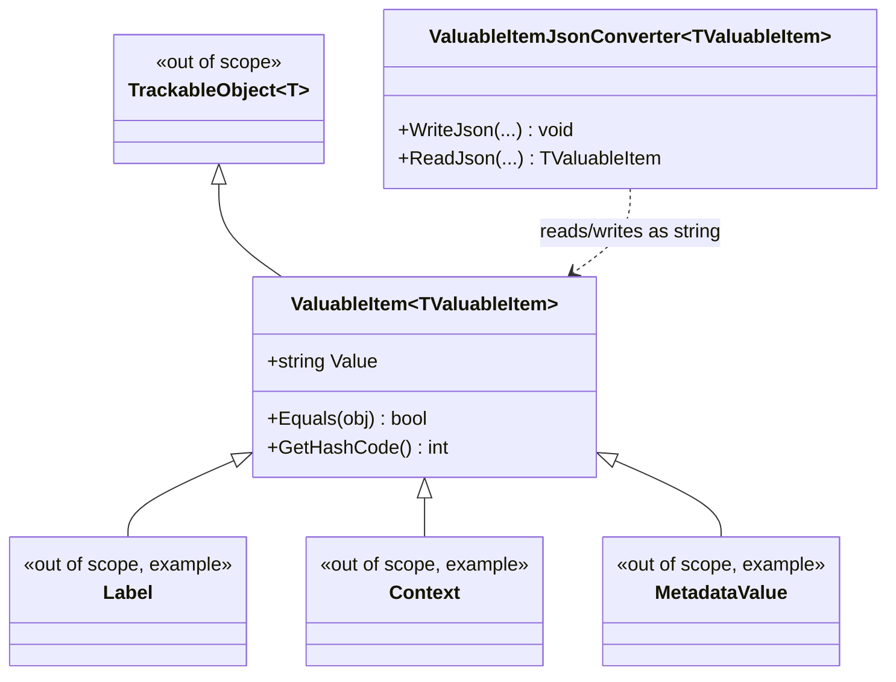

# ValuableItem

## Contents
- [Overview](#overview)
- [Files](#files)
- [Types & Members](#types--members)
  - [ValuableItem\<TValuableItem\>](#valuableitemtvaluableitem)
  - [ValuableItemJsonConverter\<TValuableItem\>](#valuableitemjsonconvertertvaluableitem)
- [Diagrams](#diagrams)
- [Package Dependencies](#package-dependencies)
- [See Also](#see-also)

## Overview

`IIIF.Manifests.Serializer.Shared.ValuableItem` provides the generic base class and matching JSON converter for the SDK's "simple string-valued wrapper" pattern: a small `TrackableObject`-derived type that exists only to carry one `Value : string` and serializes/deserializes as a bare JSON string rather than an object. This is the CRTP (curiously-recurring generic pattern) base for a large family of one-line model types elsewhere in the SDK — `Label`, `Context`, `Description`, `Language`, `License`, `Attribution`, `Behavior`, `ViewingHint`, `ViewingDirection`, `TimeMode`, `ImageFormat`, `ImageQuality`, `ImageFeature`, `Motivation`, `Profile`, `ResourceType`, `Rights`, and `MetadataValue` (all in `Properties/` or nested folders, out of this folder's scope) — each of which subclasses `ValuableItem<TSelf>` to get value semantics (`Equals`/`GetHashCode`/`==`/`!=` by `Value`) and transparent string-shaped JSON for free.

## Files

| File | Primary type(s) | LOC (approx) | Responsibility |
| --- | --- | --- | --- |
| `ValuableItem.cs` | `ValuableItem<TValuableItem>` | 46 | Generic base class adding a tracked `Value` string property plus value-equality semantics to `TrackableObject<TValuableItem>`. |
| `ValuableItemJsonConverter.cs` | `ValuableItemJsonConverter<TValuableItem>` | 67 | Generic `JsonConverter` that reads/writes a `ValuableItem<TValuableItem>` subtype as a plain JSON string. |

[↑ Back to top](#contents)

## Types & Members

| Type | Kind | Summary | Inherits/Implements | Key Members |
| --- | --- | --- | --- | --- |
| `ValuableItem<TValuableItem>` | class (generic, CRTP base) | Base type for "id/value" string-wrapper properties. | `TrackableObject<TValuableItem>` | `Value`, `Equals`, `GetHashCode`, `==`, `!=` |
| `ValuableItemJsonConverter<TValuableItem>` | class (generic) | Serializes/deserializes a `ValuableItem<TValuableItem>` as a bare JSON string. | `JsonConverter<TValuableItem>` | `WriteJson(...)`, `ReadJson(...)` |

### ValuableItem\<TValuableItem\>

- **Kind / Namespace**: public generic class, `IIIF.Manifests.Serializer.Shared.ValuableItem`.
- **Inherits/Implements**: `TrackableObject<TValuableItem>`, where `TValuableItem : ValuableItem<TValuableItem>` (CRTP — the type parameter constrains to itself, matching the `TrackableObject<T>` convention used throughout the SDK).
- **Attributes**: `[JsonConverter(typeof(ValuableItemJsonConverter<>))]` on the class — every `ValuableItem<T>`-derived property is, by default, read/written as a plain JSON string via the open generic converter below.
- **Key properties**:
  - `Value : string` — `virtual`, tracked via `GetElementValue`/`SetElementValue` (the same change-tracking mechanism as other `TrackableObject` properties); private setter, so mutation only happens through the constructor or a derived type's own API; non-null (`!` on getter).
- **Constructors**: `public ValuableItem(string value)` — sets `Value` directly; there is no parameterless constructor, so every subclass must either forward a `string` (commonly via a C# primary constructor, e.g. `class Label(string value) : ValuableItem<Label>(value)`) or otherwise supply one.
- **Key methods / overrides**:
  - `override bool Equals(object? obj)` — reference-equal or same runtime family (`ValuableItem<TValuableItem>`) with equal `Value`.
  - `protected virtual bool Equals(ValuableItem<TValuableItem>? other)` — the core value-equality check, overridable by subclasses that need extra comparison logic.
  - `override int GetHashCode()` — `Value.GetHashCode()` when `Value` is non-blank, else `0`.
  - `operator ==` / `operator !=` — null-safe value equality (mirrors `Equals`, with `left?.Equals(right) ?? right is null`).
- **Thread-safety/immutability**: not immutable in the CLR sense (the private setter can still be invoked internally, and `TrackableObject` tracks property changes), but subclasses typically only ever set `Value` once at construction, giving effectively immutable, value-comparable wrapper instances in practice.
- **Usage Recipe**:
```csharp
using IIIF.Manifests.Serializer.Shared.ValuableItem;

// A typical subclass elsewhere in the SDK (out of scope, shown for illustration only):
// public class Label(string value) : ValuableItem<Label>(value);

Label a = new("Page 1");
Label b = new("Page 1");

Console.WriteLine(a == b);       // true - value equality, not reference equality
Console.WriteLine(a.Value);      // "Page 1"
```

[↑ Back to top](#contents)

### ValuableItemJsonConverter\<TValuableItem\>

- **Kind / Namespace**: public generic class, `IIIF.Manifests.Serializer.Shared.ValuableItem`.
- **Inherits/Implements**: `JsonConverter<TValuableItem>`, where `TValuableItem : ValuableItem<TValuableItem>`.
- **Key methods**:
  - `WriteJson(JsonWriter writer, TValuableItem? value, JsonSerializer serializer) : void` — writes `value.Value` as a raw JSON string when `value` is non-null and its `Value` is non-empty; otherwise writes JSON `null`.
  - `ReadJson(JsonReader reader, Type objectType, TValuableItem? existingValue, bool hasExistingValue, JsonSerializer serializer) : TValuableItem?` — returns `null` for a JSON `null` token or an empty/whitespace string token; otherwise reads the token as a string and constructs `TValuableItem` via `Activator.CreateInstance`, explicitly passing `BindingFlags.Instance | BindingFlags.Public | BindingFlags.NonPublic` so it can reach a subclass's constructor regardless of its declared visibility (public, private, or internal, e.g. `PointSelector`'s pattern of a private `[JsonConstructor]` elsewhere in the SDK).
- **Thread-safety/immutability**: stateless converter (no instance fields); safe to reuse across concurrent (de)serializations.
- **Reflection caveat**: `ReadJson` uses `Activator.CreateInstance` reflectively every call rather than a cached delegate/factory — acceptable for this SDK's typical manifest sizes, but worth knowing if profiling shows converter overhead on very large documents with many `ValuableItem`-derived properties.
- **Usage Recipe**: like `SelectorJsonConverter`, this converter is applied automatically via the `[JsonConverter(typeof(ValuableItemJsonConverter<>))]` attribute on `ValuableItem<TValuableItem>` — callers do not construct or invoke it directly:
```csharp
using IIIF.Manifests.Serializer.Shared.ValuableItem;

// { "label": "Page 1" }  <->  a Label instance whose Value is "Page 1",
// via ValuableItemJsonConverter<Label>, with no explicit converter wiring needed.
```

[↑ Back to top](#contents)

## Diagrams



`ValuableItem<TValuableItem>` is a CRTP base over `TrackableObject<T>` adding string-value equality; `ValuableItemJsonConverter<TValuableItem>` is applied automatically via attribute to serialize any subclass (e.g. `Label`, `Context`, `MetadataValue`, all elsewhere in the SDK) as a bare JSON string instead of an object.

[↑ Back to top](#contents)

## Package Dependencies

| Package | Version | Description | Links |
| --- | --- | --- | --- |
| Newtonsoft.Json | 13.0.4 | JSON.NET — this SDK's serialization engine (custom JsonConverters, attribute-driven read/write) | [NuGet](https://www.nuget.org/packages/Newtonsoft.Json/13.0.4) |

[↑ Back to top](#contents)

## See Also

- [`../README.md`](../README.md) — Shared root
- [`../../README.md`](../../README.md) — top-level SDK docs
- [`../../SDK_VERSIONING_GUIDE.md`](../../SDK_VERSIONING_GUIDE.md) — SDK versioning guide

[↑ Back to top](#contents)
