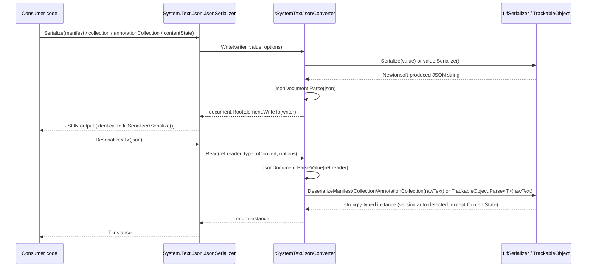

# SystemTextJson

## Contents

- [Overview](#overview)
- [Files](#files)
- [Types & Members](#types--members)
  - [ManifestSystemTextJsonConverter](#manifestsystemtextjsonconverter)
  - [CollectionSystemTextJsonConverter](#collectionsystemtextjsonconverter)
  - [AnnotationCollectionSystemTextJsonConverter](#annotationcollectionsystemtextjsonconverter)
  - [ContentStateSystemTextJsonConverter](#contentstatesystemtextjsonconverter)
- [Diagrams](#diagrams)
- [Package Dependencies](#package-dependencies)
- [See Also](#see-also)

## Overview

This folder (`src/IIIF.Manifest.Serializer.Net/SystemTextJson/`, namespace
`IIIF.Manifests.Serializer.SystemTextJson`) provides a small interop bridge that lets consumers
serialize/deserialize the SDK's 4 top-level document types with **`System.Text.Json`** instead of
Newtonsoft.Json, and get exactly the same correct, version-aware IIIF JSON either way. It exists
because `System.Text.Json`'s own reflection-based default serialization produces silently *wrong*
output against these Newtonsoft-attributed types - not an error, just incorrect JSON - so the bridge
is required, not merely a convenience. Architecturally this folder is a thin adapter layer, not a
second serialization engine: each converter here has no independent read/write logic of its own,
it only shuttles bytes through `JsonDocument`/`Utf8JsonReader`/`Utf8JsonWriter` and immediately
delegates the real work back to this SDK's existing Newtonsoft-based core (`IiifSerializer` for
three of the four types, `TrackableObject` for the fourth). There is exactly one source of truth
for how each document type reads and writes IIIF JSON, regardless of which JSON library a
consumer's application happens to use elsewhere.

[↑ Back to top](#contents)

## Files

| File | Primary type(s) | LOC (approx) | Responsibility |
| ---- | ---------------- | ------------ | --------------- |
| `ManifestSystemTextJsonConverter.cs` | `ManifestSystemTextJsonConverter` | 28 | Bridges `System.Text.Json` reads/writes of `Manifest` to `IiifSerializer.Serialize`/`DeserializeManifest`. |
| `CollectionSystemTextJsonConverter.cs` | `CollectionSystemTextJsonConverter` | 28 | Bridges `System.Text.Json` reads/writes of `Collection` to `IiifSerializer.Serialize`/`DeserializeCollection`. |
| `AnnotationCollectionSystemTextJsonConverter.cs` | `AnnotationCollectionSystemTextJsonConverter` | 29 | Bridges `System.Text.Json` reads/writes of `AnnotationCollection` to `IiifSerializer.Serialize`/`DeserializeAnnotationCollection`. |
| `ContentStateSystemTextJsonConverter.cs` | `ContentStateSystemTextJsonConverter` | 30 | Bridges `System.Text.Json` reads/writes of `ContentState` to `TrackableObject.Parse<ContentState>`/`ContentState.Serialize()` (no version dispatch - Content State has no legacy shape). |

[↑ Back to top](#contents)

## Types & Members

| Type | Kind | Summary | Inherits/Implements | Key Members |
| ---- | ---- | ------- | -------------------- | ------------ |
| `ManifestSystemTextJsonConverter` | `sealed class` | Bridge converter for `Manifest` | `System.Text.Json.Serialization.JsonConverter<Manifest>` | `Read`, `Write` |
| `CollectionSystemTextJsonConverter` | `sealed class` | Bridge converter for `Collection` | `System.Text.Json.Serialization.JsonConverter<Collection>` | `Read`, `Write` |
| `AnnotationCollectionSystemTextJsonConverter` | `sealed class` | Bridge converter for `AnnotationCollection` | `System.Text.Json.Serialization.JsonConverter<AnnotationCollection>` | `Read`, `Write` |
| `ContentStateSystemTextJsonConverter` | `sealed class` | Bridge converter for `ContentState` (Content State 1.0) | `System.Text.Json.Serialization.JsonConverter<ContentState>` | `Read`, `Write` |

All four types are `public sealed class`, declared in namespace `IIIF.Manifests.Serializer.SystemTextJson`, and hold no fields - every member below is either an inherited `System.Text.Json.Serialization.JsonConverter<T>` member or one of the two overrides shown. None declares an explicit constructor, so each relies on the implicit public parameterless constructor, which is what `[JsonConverter(typeof(...))]` and manual `new` both invoke.

### ManifestSystemTextJsonConverter

- **Kind / Namespace**: `public sealed class`, `IIIF.Manifests.Serializer.SystemTextJson`
- **Inherits/Implements**: `System.Text.Json.Serialization.JsonConverter<Manifest>` (target: `IIIF.Manifests.Serializer.Nodes.Manifest`)
- **Attributes**: none on the class itself; it is the *target* of an attribute applied elsewhere - `Nodes/Manifest.cs:19` carries `[System.Text.Json.Serialization.JsonConverter(typeof(SystemTextJson.ManifestSystemTextJsonConverter))]` directly on the `Manifest` class, per this project's convention of attaching the System.Text.Json converter attribute at the target type rather than registering it through `JsonSerializerOptions.Converters`.
- **Key properties**: none.
- **Key methods**:
  - `public override Manifest Read(ref Utf8JsonReader reader, Type typeToConvert, JsonSerializerOptions options)` - parses the current value with `JsonDocument.ParseValue(ref reader)` and returns `IiifSerializer.DeserializeManifest(document.RootElement.GetRawText())`. Version (2.x vs 3.0) is auto-detected inside `IiifSerializer`, same as calling it directly.
  - `public override void Write(Utf8JsonWriter writer, Manifest value, JsonSerializerOptions options)` - calls `IiifSerializer.Serialize(value)` to get the Newtonsoft-produced JSON string, reparses it with `JsonDocument.Parse(...)`, and writes it out via `document.RootElement.WriteTo(writer)`.
- **Constructors**: implicit public parameterless constructor only.
- **Thread-safety/immutability**: stateless - no fields, no mutable state captured across calls. Each `Read`/`Write` call is self-contained (its own `JsonDocument`, disposed via `using`), so a single instance is safe to reuse concurrently, consistent with `System.Text.Json`'s expectation that converters behave as stateless, thread-safe singletons.
- **Usage Recipe**:

```csharp
using System.Text.Json;
using IIIF.Manifests.Serializer.Nodes;

// No converter registration needed - Manifest already carries
// [JsonConverter(typeof(ManifestSystemTextJsonConverter))].
string json = JsonSerializer.Serialize(manifest);              // == IiifSerializer.Serialize(manifest)
Manifest roundTripped = JsonSerializer.Deserialize<Manifest>(json)!;

// ASP.NET Core controller - System.Text.Json is the default (de)serializer:
// return Ok(manifest);
```

[↑ Back to top](#contents)

### CollectionSystemTextJsonConverter

- **Kind / Namespace**: `public sealed class`, `IIIF.Manifests.Serializer.SystemTextJson`
- **Inherits/Implements**: `System.Text.Json.Serialization.JsonConverter<Collection>` (target: `IIIF.Manifests.Serializer.Nodes.Collection`)
- **Attributes**: none on the class itself; applied as the converter for `Collection` at `Nodes/Collection.cs:17` - `[System.Text.Json.Serialization.JsonConverter(typeof(SystemTextJson.CollectionSystemTextJsonConverter))]`.
- **Key properties**: none.
- **Key methods**:
  - `public override Collection Read(ref Utf8JsonReader reader, Type typeToConvert, JsonSerializerOptions options)` - parses via `JsonDocument.ParseValue(ref reader)` and returns `IiifSerializer.DeserializeCollection(document.RootElement.GetRawText())`.
  - `public override void Write(Utf8JsonWriter writer, Collection value, JsonSerializerOptions options)` - reparses `IiifSerializer.Serialize(value)` with `JsonDocument.Parse(...)` and writes it via `document.RootElement.WriteTo(writer)`.
- **Constructors**: implicit public parameterless constructor only.
- **Thread-safety/immutability**: stateless, same pattern as `ManifestSystemTextJsonConverter` - safe as a shared singleton.
- **Usage Recipe**:

```csharp
using System.Text.Json;
using IIIF.Manifests.Serializer.Nodes;

string json = JsonSerializer.Serialize(collection);              // == IiifSerializer.Serialize(collection)
Collection roundTripped = JsonSerializer.Deserialize<Collection>(json)!;

// return Ok(collection); // ASP.NET Core - same JSON as IiifSerializer, no extra config
```

[↑ Back to top](#contents)

### AnnotationCollectionSystemTextJsonConverter

- **Kind / Namespace**: `public sealed class`, `IIIF.Manifests.Serializer.SystemTextJson`
- **Inherits/Implements**: `System.Text.Json.Serialization.JsonConverter<AnnotationCollection>` (target: `IIIF.Manifests.Serializer.Nodes.Contents.Annotation.AnnotationCollection`)
- **Attributes**: none on the class itself; applied as the converter for `AnnotationCollection` at `Nodes/Contents/Annotation/AnnotationCollection.cs:16` - `[System.Text.Json.Serialization.JsonConverter(typeof(SystemTextJson.AnnotationCollectionSystemTextJsonConverter))]`.
- **Key properties**: none.
- **Key methods**:
  - `public override AnnotationCollection Read(ref Utf8JsonReader reader, Type typeToConvert, JsonSerializerOptions options)` - parses via `JsonDocument.ParseValue(ref reader)` and returns `IiifSerializer.DeserializeAnnotationCollection(document.RootElement.GetRawText())`.
  - `public override void Write(Utf8JsonWriter writer, AnnotationCollection value, JsonSerializerOptions options)` - reparses `IiifSerializer.Serialize(value)` with `JsonDocument.Parse(...)` and writes it via `document.RootElement.WriteTo(writer)`.
- **Constructors**: implicit public parameterless constructor only.
- **Thread-safety/immutability**: stateless, same pattern as the other three converters in this folder.
- **Usage Recipe**:

```csharp
using System.Text.Json;
using IIIF.Manifests.Serializer.Nodes.Contents.Annotation;

string json = JsonSerializer.Serialize(annotationCollection);
AnnotationCollection roundTripped = JsonSerializer.Deserialize<AnnotationCollection>(json)!;

// return Ok(annotationCollection); // ASP.NET Core action result
```

[↑ Back to top](#contents)

### ContentStateSystemTextJsonConverter

- **Kind / Namespace**: `public sealed class`, `IIIF.Manifests.Serializer.SystemTextJson`
- **Inherits/Implements**: `System.Text.Json.Serialization.JsonConverter<ContentState>` (target: `IIIF.Manifests.Serializer.Nodes.Contents.ContentState.ContentState`, referenced in the source file via the alias `ContentStateDocument = IIIF.Manifests.Serializer.Nodes.Contents.ContentState.ContentState` to avoid ambiguity with the `System.Text.Json` `ContentState` name/namespace segment)
- **Attributes**: none on the class itself; applied as the converter for `ContentState` at `Nodes/Contents/ContentState/ContentState.cs:17` - `[System.Text.Json.Serialization.JsonConverter(typeof(SystemTextJson.ContentStateSystemTextJsonConverter))]`.
- **Key properties**: none.
- **Key methods**:
  - `public override ContentStateDocument Read(ref Utf8JsonReader reader, Type typeToConvert, JsonSerializerOptions options)` - parses via `JsonDocument.ParseValue(ref reader)` and returns `TrackableObject.Parse<ContentStateDocument>(document.RootElement.GetRawText())`.
  - `public override void Write(Utf8JsonWriter writer, ContentStateDocument value, JsonSerializerOptions options)` - reparses `value.Serialize()` with `JsonDocument.Parse(...)` and writes it via `document.RootElement.WriteTo(writer)`.
- **Constructors**: implicit public parameterless constructor only.
- **Thread-safety/immutability**: stateless, same pattern as the other three converters. Unlike the other three, this one never touches `IiifSerializer` - Content State 1.0 has no legacy shape to auto-detect, so it goes straight to `TrackableObject.Parse<T>`/`instance.Serialize()`. See [Shared/Trackable](../Shared/Trackable/README.md) for that delegation path.
- **Usage Recipe**:

```csharp
using System.Text.Json;
using IIIF.Manifests.Serializer.Nodes.Contents.ContentState;

string json = JsonSerializer.Serialize(contentState);              // == contentState.Serialize()
ContentState roundTripped = JsonSerializer.Deserialize<ContentState>(json)!;

// return Ok(contentState); // ASP.NET Core action result
```

[↑ Back to top](#contents)

## Diagrams



Both directions funnel through the same two-line pattern in every converter: `Write` asks the
Newtonsoft-based core for a JSON string and reparses it into the `Utf8JsonWriter`; `Read` reparses
the incoming `Utf8JsonReader` into raw text and hands it to the Newtonsoft-based core. `Manifest`,
`Collection`, and `AnnotationCollection` route through `IiifSerializer`'s version-aware
dispatch; `ContentState` routes through `TrackableObject.Parse`/`.Serialize()` instead, since it has
no legacy shape to detect.

[↑ Back to top](#contents)

## Package Dependencies

| Package | Version | Description | Links |
| ------- | ------- | ------------ | ----- |
| Newtonsoft.Json | 13.0.4 | JSON.NET - this SDK's serialization engine (custom JsonConverters, attribute-driven read/write) | [NuGet](https://www.nuget.org/packages/Newtonsoft.Json/13.0.4) |
| System.Text.Json | 8.0.5 | Microsoft's JSON library - bridged to, not replacing, the Newtonsoft-based core | [NuGet](https://www.nuget.org/packages/System.Text.Json/8.0.5) |

Adding this folder is what required adding the `System.Text.Json` package reference to
`src/IIIF.Manifest.Serializer.Net/IIIF.Manifest.Serializer.Net.csproj` in the first place - the core
SDK project was Newtonsoft-only before Round 5 (see [SDK_VERSIONING_GUIDE.md](../SDK_VERSIONING_GUIDE.md)).

[↑ Back to top](#contents)

## See Also

- [Shared/Trackable](../Shared/Trackable/README.md) - `TrackableObject.Parse<T>`/`.Serialize()`, the delegation target for `ContentStateSystemTextJsonConverter`.
- [Top-level README](../README.md#newtonsoftjson-and-systemtextjson-interop) - "Newtonsoft.Json and System.Text.Json interop" section, the narrative overview of this bridge from a consumer's perspective.
- [SDK_VERSIONING_GUIDE.md - Round 5](../SDK_VERSIONING_GUIDE.md#round-5-systemtextjson-interop-for-the-4-top-level-document-types) - the design rationale for this folder: why the bridge is required (not optional), the rejected alternative of reimplementing every Newtonsoft converter for System.Text.Json, and the test coverage added.
- [SDK_VERSIONING_GUIDE.md - Round 4](../SDK_VERSIONING_GUIDE.md#round-4-structural-refactor---file-size-reduction-facadestrategyregistry-patterns) - the structural refactor (Facade/Strategy/Registry patterns) immediately preceding Round 5, which this bridge builds on top of.

[↑ Back to top](#contents)
