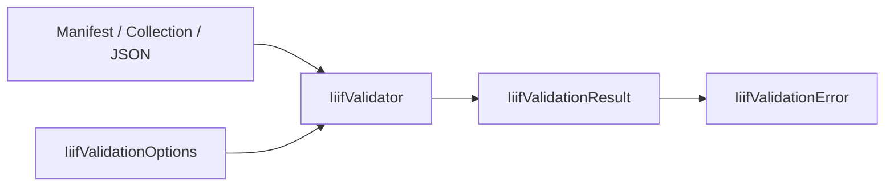

# Validation

## Overview

`IIIF.Manifests.Serializer.Validation` is the SDK's opt-in validation layer. Parsing remains
tolerant; callers explicitly validate a model or JSON document and receive structured findings.
Rules can be target-version-aware, and strict mode enables additional authoring checks.

## Files and types

| File | Public type | Purpose |
| --- | --- | --- |
| `IiifValidator.cs` | `IiifValidator` | Validates manifests, collections, or manifest JSON |
| `IiifValidationOptions.cs` | `IiifValidationOptions` | Selects the target Presentation API version and strict mode |
| `IiifValidationResult.cs` | `IiifValidationResult` | Exposes `Errors` and computed `IsValid` |
| `IiifValidationError.cs` | `IiifValidationError` | Immutable rule ID, severity, message, and path |
| `IiifValidationSeverity.cs` | `IiifValidationSeverity` | `Info`, `Warning`, or `Error` |
| `IsExternalInit.cs` | internal `IsExternalInit` | netstandard2.1 compiler support for record types |

## Entry points

```csharp
using IIIF.Manifests.Serializer.Validation;

IiifValidationResult result = IiifValidator.ValidateManifest(
    manifest,
    new IiifValidationOptions(IiifPresentationVersion.V3_0, Strict: true));

foreach (IiifValidationError finding in result.Errors)
    Console.WriteLine($"{finding.Severity}: {finding.RuleId} at {finding.Path}");
```

- `ValidateManifest` checks a constructed manifest and its canvases.
- `ValidateCollection` checks a constructed collection.
- `ValidateJson` parses and validates manifest JSON; malformed JSON becomes a
  `json-parse-error` finding rather than escaping as a JSON exception.
- Only `Error` findings make `IiifValidationResult.IsValid` false.
- A 2.0/2.1 target reports 3.0-only data that would be omitted during downgrade.

## Diagrams



## See also

- [Project guide: validation](../README.md#validation)
- [Version-aware serialization](../SDK_VERSIONING_GUIDE.md)
